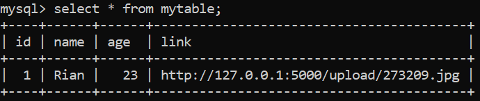

# Simple Employee Registration Program using Flask and mySQL
A simple Python project to create an employee registration form using Flask framework and storing the data into mySQL database using mySQLdb package in Python.
1. Activate mySQL server, create a database named 'employee' with a table named 'mytable' inside
    ```bash
    $ mysql.exe -u <yourUsername> -p
    $ Enter password: <yourPassword>
    $ create database employee;
    $ use employee;
    $ create table mytable(
        id int auto_increment,
        name varchar(30) default 'No Name',
        age int(3) default 0,
        link varchar(200),
        primary key(id)
        );
    ```

2. Create a new folder named 'storage' to store the uploaded photos.

3. Clone this repo & run *regist.py* file

4. A screenshot of how the main route will look like:
    
    
5. To check the saved database in mySQL, use:
    ```bash
    $ select * from mytable
    ```
    and the saved database would look like:
    
    **_Enjoy!_**

#

#### Albertus Rianto Wibisono ✉ _albertusrian95@gmail.com_

[Instagram](https://www.facebook.com/rian__wibisono) | 
[LinkedIn](https://www.linkedin.com/in/albertusrian95/) |
[GitHub](https://www.github.com/RiantoWibisono)
